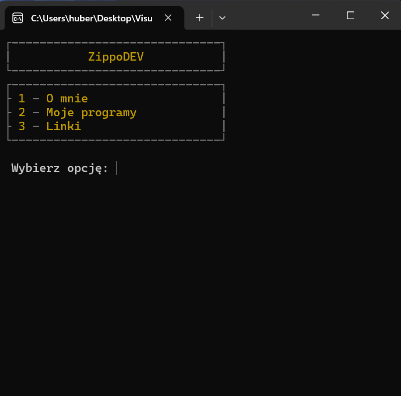
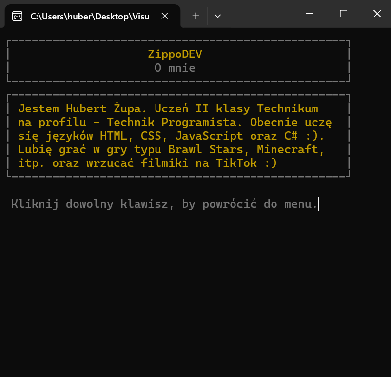
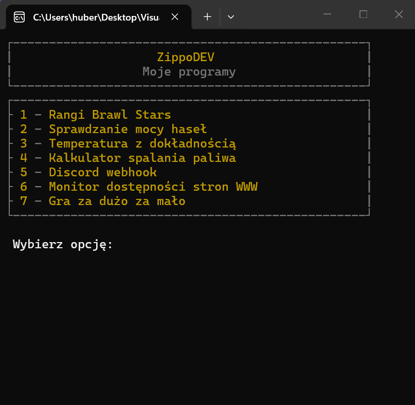
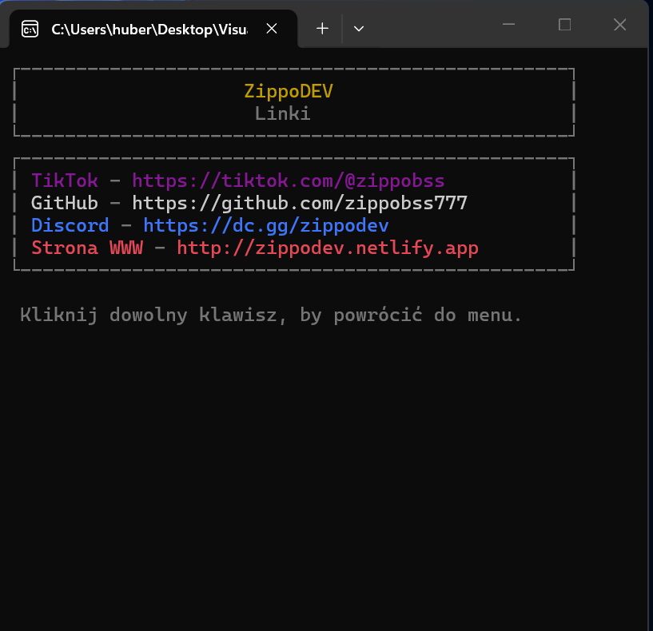

# ZippoDEV 💸
Program oferuje 3 opcje: "O mnie", "Moje Programy", "Linki". W zależności od wybranej opcji, program zwraca oczekującą odpowiedź.
## ✨ O mnie

Program wyświetla mój krótki opis.

## ⚡ Moje Programy

Program wyświetla listę moich najlepszych programów, gdzie można poszczególny program wybrać, wpisując przypisaną do niego cyfrę, a program się uruchomi w tym samym oknie. Po zakończeniu działania programu, można łatwo wrócić do Menu Głównego.

## 🌐 Linki

Program wyświetla listę linków przekierowujących do moich najważniejszych medii społecznościowych itp.
## 👨🏿 Autor

- [@zippobss777](https://www.github.com/zippobss777)
## ⁉️ Pytania

Jeżeli masz jakieś pytania to stwórz ticketa na moim discordzie (http://dc.gg/zippodev) lub uzupełnij formularz kontaktowy na mojej stronie internetowej (http://zippodev.netlify.app).


## 📸 Screenshots





## 🖥️ Uruchamianie lokalnie

Sklonuj projekt w konsoli cmd/powershell lub GitBash

```bash
  git clone https://github.com/zippobss777/ZippoDEV.git
```

Przejdź do folderów kolejno:

```bash
  ZippoDEV (główny folder projektu) > bin > Debug > net10.0
```

Uruchom plik

```bash
  ZippoDEV.exe
```

